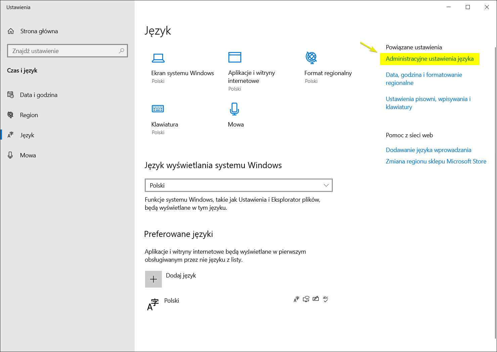
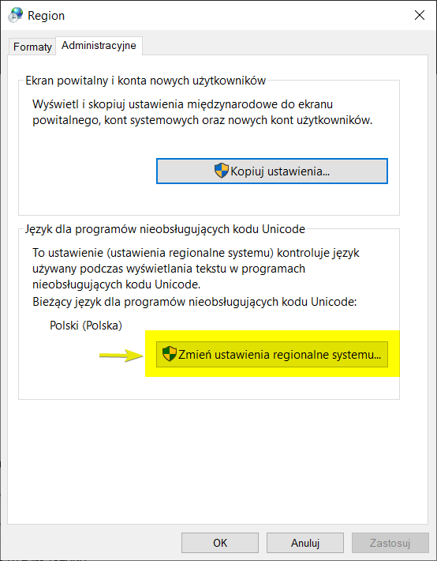
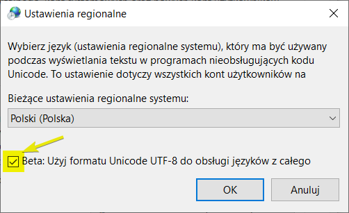

# BD2 – stanowisko pracy

## Kroki wstępne

Jeśli Twoim „głównym” systemem operacyjnym jest __Windows 10__ (w wersji __1903__ lub nowszej) to:

- Zainstaluj i skonfiguruj rozszerzenie [Windows Subsystem for Linux](https://docs.microsoft.com/en-us/windows/wsl/install-win10) w wersji __2__ (__WSL2__).

- Jeśli podczas zajęć wolisz pracować w środowisku systemu __Linux__ to oprócz __WSL2__ zainstaluj [Ubuntu 20.04 LTS](https://www.microsoft.com/en-us/p/ubuntu-2004-lts/9n6svws3rx71?activetab=pivot:overviewtab) z __Microsoft Store__.

## Kroki obowiązkowe

- Upewnij się, że na Twoim komputerze zainstalowany jest edytor __Visual Studio Code__

- Zainstaluj [Node.js](https://nodejs.org/en/) (użyj wersji „LTS”)

   Pamiętaj żeby zainstalować wersję dla systemu, którego będziesz używać podczas zajęć. Jeśli Twoja maszyna wykorzystuje np. _Windows 10_ jako „główny system”, ale na zajęciach chesz korzystać z _Ubuntu 20.04_ w środowisku __WSL2__ (patrz – „kroki wstępne” powyżej) to oczywiście __Node.js__ zainstalujesz wewnątrz „maszyny linuksowej”.

- Zainstaluj Docker-a

	[Docker Desktop](https://www.docker.com/products/docker-desktop) – dla systemów __Windows 10__ lub __MacOS__

    [Docker Engine](https://docs.docker.com/engine/install/ubuntu/) – dla systemu __Ubuntu Linux__

Jeśli w ramach „kroków wstępnych” zainstalował(a/e)ś __WSL2__ to skonfiguruj __Docker Desktop__ tak, żeby używał właśnie WSL2.

## Kroki bardzo zalecane

- Zainstaluj (odpowiednią wersję – w zależności od używanego „głównego” systemu operacyjnegp) aplikacji [DBeaver Enterprise Edition](https://dbeaver.com/download/). Aplikacja ta wymaga wystąpienia o [licencję edukacyjną](https://dbeaver.com/academic-license/). Na szczęście, przed jej otrzymaniem, można (na krótko) włączyć „tryb próbny” (_trial_).

- Jeśli głównym systemem na Twoim komputerze jest _Windows 10_

    - Zainstaluj Powershell Core

	    [Powershell Core](https://github.com/PowerShell/PowerShell/releases)

    - Zainstaluj Windows Terminal

        [Windows Terminal w Microsoft Store](https://www.microsoft.com/pl-pl/p/windows-terminal/9n0dx20hk701?activetab=pivot:overviewtab)

## Dodatkowa konfiguracja Windows 10

W konsoli (niezależnie od tego, czy chcemy działać „bezpośrednio” pod __Windows 10__, czy w maszynie linuksowej wewnętrz __WSL2__) chcemy używać standardowego kodowania __UTF-8__. Aby to uzyskać, należy dokonać następującego zabiegu konfiguracyjnego:








# Instalacja PostgreSQL-a (na pierwsze laboratoria)

Zakładając, że __Docker Desktop__ (lub __Docker__) został już zainstalowany i uruchomiony, w odpowiednim oknie terminala (np. _Ubuntu 20:04_ pod Windows) wydajemy polecenie:

```
docker run --name postgres -e POSTGRES_PASSWORD=tajne -d -p 5432:5432 postgres:14
```

Spowoduje ono pobranie „obrazu dockerowego”, stworzenie, a następnie uruchomienie „kontenera” oferującego serwer __PostgreSQL__ (w najnowszej obecnie „stabilnej” wersji __14__).

Zakładając, że zainstalowaliśmy narzędzie __DBeaver Enterprise__ możemy następnie zdefiniować nowe połączenie z tak uruchomionym serwerem. Oczywiście możemy też „wypróbować” serwer z poziomu __Node.js__ (bez konieczności korzystania z __DBeaver__-a).

Żeby zdefiniować takie połączenie należy z menu __DBeaver__ wybrać

```
File -> New -> DBeaver -> Database Connection -> PostgreSQL
```

i dodać `tajne` jako hasło.

## Przykładowy projekt Node.js + PostgreSQL

```
git clone git@gitlab.com:bazy-danych-2/21-22/wyklad/01.git
```

Uwaga! Jeśli ktoś nie ma dostępu do powyższego repozytorium to prawdopodobnie nie dotarły do mnie jego dane z GitLab-a. Proszę mi je w takiej sytuacji przesłać w komunikatorze Teams.

